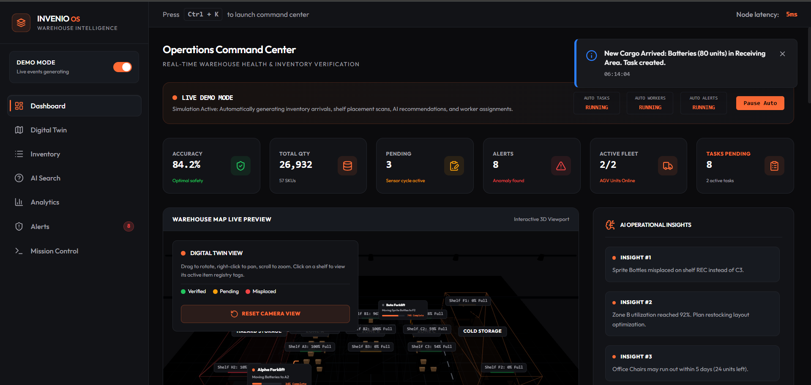
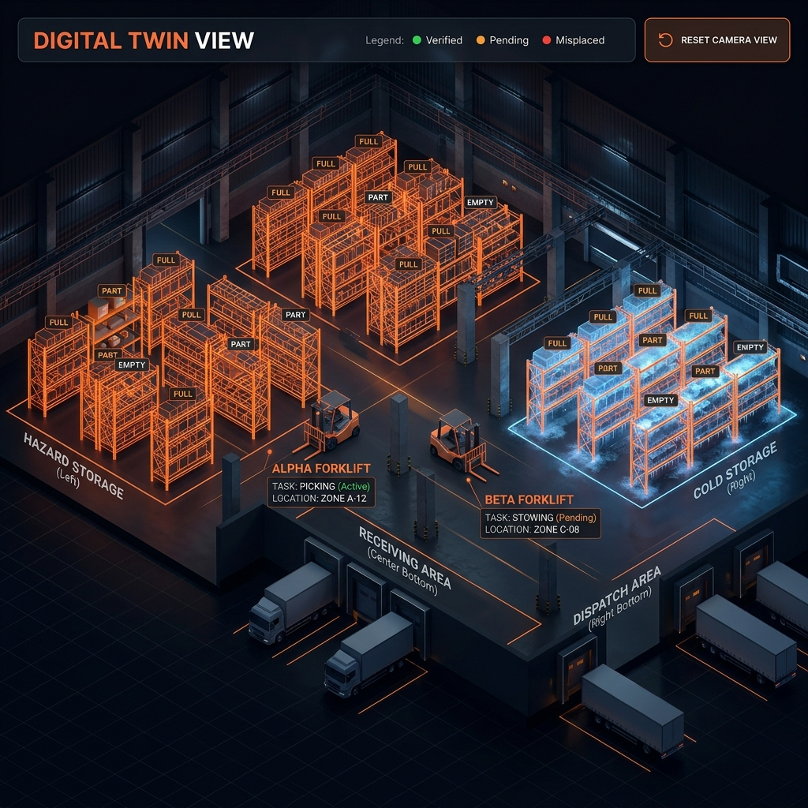
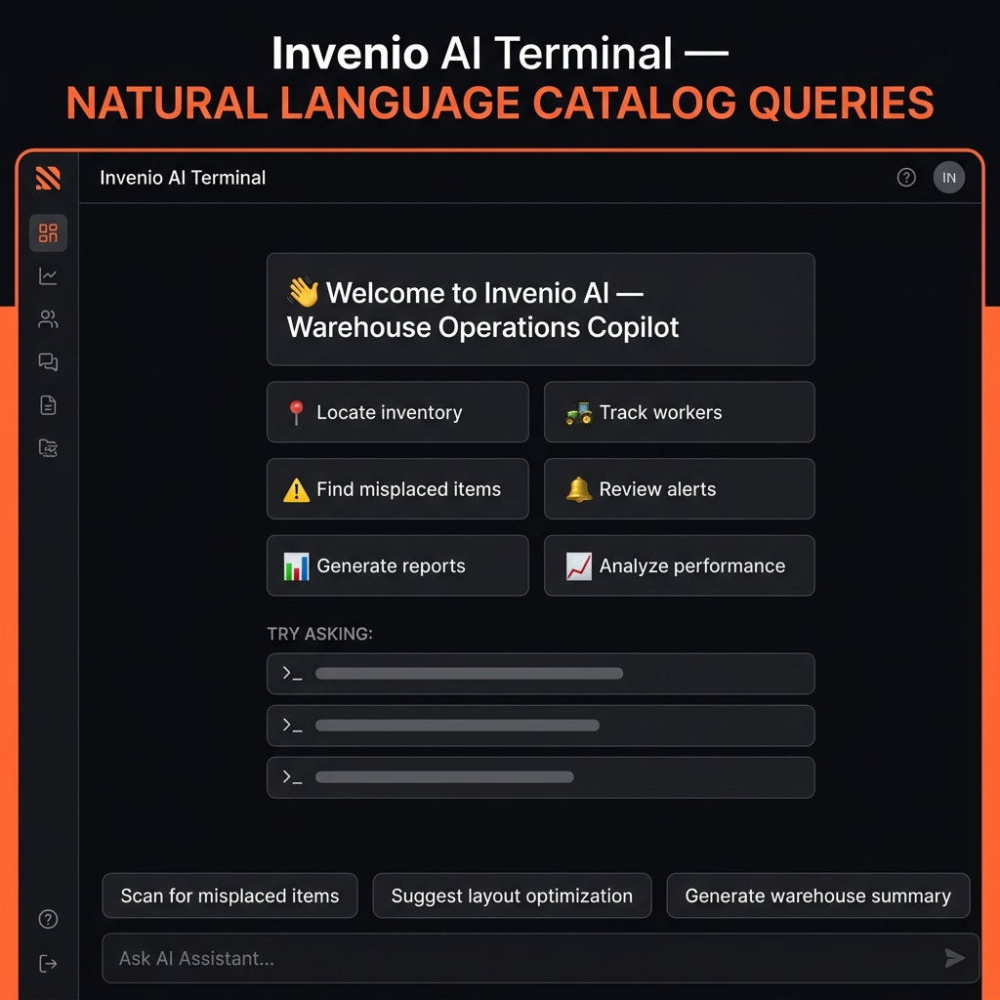
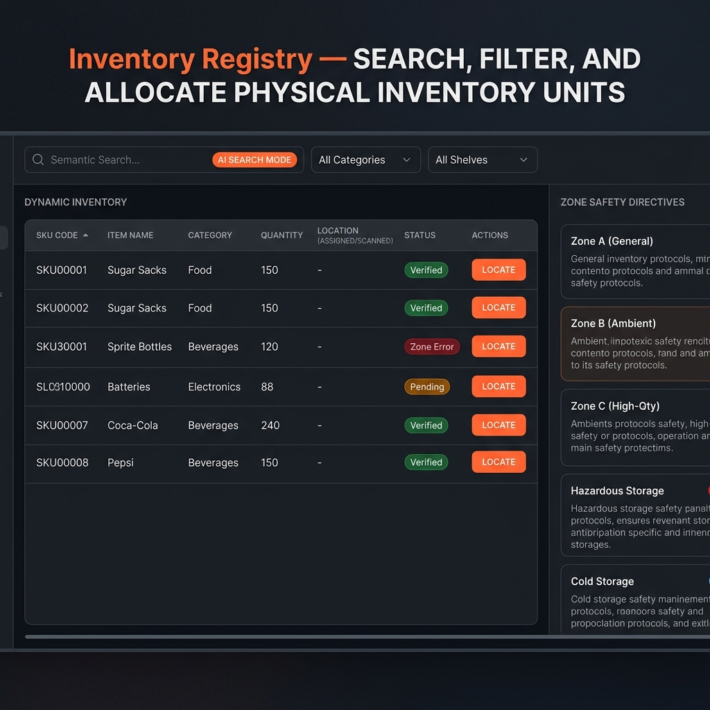
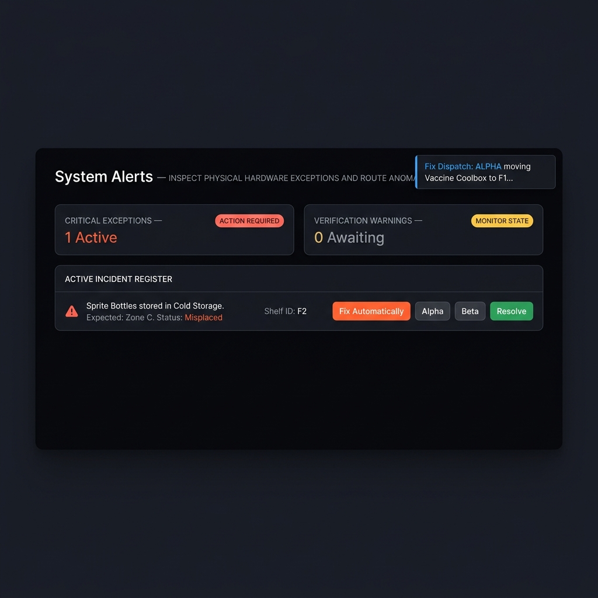
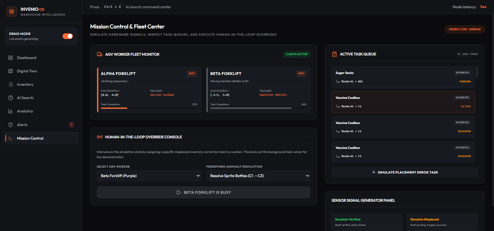

# Invenio OS

**Warehouse Intelligence Platform** — Real-time Digital Twin, Worker Fleet Coordination, Inventory Validation, and AI-Assisted Operations.

<div align="center">

[](LICENSE)
[](https://react.dev)
[](https://www.typescriptlang.org)
[](https://vitejs.dev)
[](https://threejs.org)

</div>

---

## The Problem

Modern warehouses are difficult to manage in real time.

- **Misplaced inventory** causes workers to spend hours searching for items that are in the wrong shelf zone.
- **No live visibility** means supervisors only discover stock discrepancies during manual audits — hours or days too late.
- **Safety violations** go undetected when hazardous materials are stored in incorrect zones.
- **Worker coordination** is done verbally or via paper tickets, creating delays, errors, and wasted trips.
- **Disconnected systems** mean the inventory registry, task queue, and physical floor are never in sync.

---

## The Solution

Invenio OS is a single platform that connects every layer of a warehouse operation:

| Layer | What it does |
|---|---|
| **Digital Twin** | A 3D live model of the warehouse — shelves, workers, forklifts, and zones — all updating in real time. |
| **AI Copilot** | A natural-language assistant that understands inventory, alerts, and worker states without needing an internet connection for basic queries. |
| **Worker Fleet** | Alpha and Beta forklifts are dispatched to tasks automatically. Supervisors can override and control them manually. |
| **Inventory Engine** | Every item has a SKU, zone, shelf, and validation status. The system flags misplacements the moment they occur. |
| **Mission Control** | A live operations panel to dispatch tasks, monitor worker status, run zone scans, and review alert feeds. |
| **Analytics Dashboard** | KPI cards for inventory accuracy, verification rate, active alerts, and fleet availability. |

---

## Key Features

### 🏭 3D Warehouse Digital Twin
- Live-rendered 3D warehouse environment built with Three.js and React Three Fiber.
- Workers (Alpha & Beta forklifts) move in real time across shelves and zones.
- Camera can follow individual workers with a stabilised tracking mode.
- Shelf highlight system marks located inventory items on the 3D floor.

### 🤖 AI-Powered Warehouse Copilot
- **Layer 1 — Local Intelligence Engine**: Handles all inventory lookups, worker tracking, alerts, and task operations instantly without any API call.
- **Layer 2 — GPT-OSS-120B (OpenRouter)**: Used for natural-language summaries, recommendations, layout analysis, and explanations.
- **AI Failover**: If the API is unavailable, the system seamlessly falls back to Layer 1 with a clear user notification.
- **Session Memory**: The AI remembers the conversation context, enabling follow-up questions like "Where is it?" or "Who is assigned to fix that?"
- **Response Caching**: Repeated analytical queries are cached to reduce latency and API calls.

### 📋 Worker Task Management
- Automatic task dispatch: Workers are assigned to move misplaced items back to their correct shelf.
- Task queue with status tracking (pending → active → complete).
- NFC verification flow: workers scan a tag at the destination shelf to confirm delivery.
- Route visualisation overlaid on the 3D twin.

### 🕹️ Manual Worker Control
- WASD keyboard controls for direct forklift operation.
- Task completion workflow: pick up item → route to shelf → scan NFC → complete.

### 📦 Inventory Registry
- Full item registry with SKU, category, zone, shelf, quantity, and status.
- Add, update, and remove inventory via the AI assistant or the inventory panel.
- Real-time status badges: Verified, Pending, Error.
- Misplacement detection compares `assignedShelf` vs `currentShelf` for every item.

### ✅ Zone Validation
- Hazardous materials validation: flags items placed in the wrong zone.
- Cold storage verification for temperature-sensitive goods.
- Layout optimisation utility that reorganises shelf assignments.

### 🔔 Alerts & Incident Management
- Live alert feed with severity levels: Critical, Warning, Info.
- One-click resolution with automatic activity log entries.
- Filter by severity and zone.

### 📊 Dashboard Analytics
- KPI widgets: Inventory Accuracy, Verified Shelves, Active Alerts, Fleet Status.
- Activity log with real-time telemetry events.
- System health indicators.

### 🎮 Simulated Warehouse Operations
- Continuous simulation loop: workers patrol, pick, deliver, and return to idle.
- Randomised anomaly injection for demonstration purposes.
- Full pause/resume/reset controls.

---

## Technology Stack

### Frontend
| Tech | Version | Purpose |
|---|---|---|
| React | 19 | UI framework |
| TypeScript | ~6 | Type safety |
| Vite | 8 | Build tool & dev server |
| Zustand | 5 | Global state management |
| Tailwind CSS | 4 | Utility-first styling |
| Framer Motion | 12 | Animations & transitions |
| Lucide React | latest | Icon system |

### 3D Rendering
| Tech | Version | Purpose |
|---|---|---|
| Three.js | r184 | 3D engine |
| React Three Fiber | 9 | React bindings for Three.js |
| React Three Drei | 10 | Helpers & abstractions |

### AI
| Tech | Purpose |
|---|---|
| Local Warehouse Intelligence Engine | Layer 1 — instant, offline, deterministic responses |
| OpenRouter API | Layer 2 — GPT-OSS-120B free model for natural language analysis |

---

## Architecture Overview

```
┌────────────────────────────────────────────────────────────┐
│                        Invenio OS                          │
│                    React + TypeScript                       │
│                                                            │
│  ┌─────────────┐  ┌──────────────┐  ┌──────────────────┐  │
│  │  Dashboard  │  │  Digital     │  │   AI Assistant   │  │
│  │  Analytics  │  │    Twin      │  │   Copilot        │  │
│  └──────┬──────┘  │  Three.js    │  │  ┌────────────┐  │  │
│         │         └──────┬───────┘  │  │  Layer 1   │  │  │
│         │                │          │  │  Local NLP │  │  │
│  ┌──────▼────────────────▼───────┐  │  └─────┬──────┘  │  │
│  │          Zustand Store         │  │        │          │  │
│  │  inventory │ workers │ alerts  │  │  ┌─────▼──────┐  │  │
│  │  shelves   │ tasks   │ routes  │  │  │  Layer 2   │  │  │
│  └───────────────────────────────┘  │  │  OpenRouter│  │  │
│                                     │  │  GPT-OSS   │  │  │
│  ┌─────────────┐  ┌──────────────┐  │  └────────────┘  │  │
│  │  Mission    │  │  Inventory   │  └──────────────────┘  │
│  │  Control    │  │  Registry    │                        │
│  └─────────────┘  └──────────────┘                        │
└────────────────────────────────────────────────────────────┘
```

---

## Getting Started

### Prerequisites
- Node.js 18+
- npm 9+
- A free [OpenRouter](https://openrouter.ai) account (optional — the platform works offline using Layer 1)

### Installation

```bash
# Clone the repository
git clone https://github.com/Shraddhav07/invenio-os.git
cd invenio-os

# Install dependencies
npm install
```

### Environment Setup

```bash
# Copy the example environment file
cp .env.example .env
```

Open `.env` and add your OpenRouter API key:

```env
VITE_OPENROUTER_API_KEY=your_actual_key_here
```

> **Note:** The platform is fully functional without an API key. Layer 1 (local warehouse intelligence) handles all inventory queries, worker tracking, alert management, and task operations without any external API call. The API key only enables Layer 2 for advanced natural-language analysis.

### Run Development Server

```bash
npm run dev
```

Open [http://localhost:5173](http://localhost:5173) in your browser.

### Build for Production

```bash
npm run build
```

---

## Screenshots

### 🖥️ Operations Command Center
The live dashboard with real-time KPI cards, a 3D warehouse map preview, and AI-generated operational insights.



---

### 🏭 Digital Twin
A 3D live model of the warehouse floor. Shelves, zones, and worker forklifts update in real time as tasks are dispatched and completed.



---

### 🤖 AI Copilot (Invenio AI)
The warehouse operations copilot. Supports natural-language queries for inventory lookup, worker tracking, alert review, and report generation — with contextual quick-action buttons on every response.



---

### 📦 Inventory Registry
Full item registry with SKU, category, zone, shelf, quantity, and live validation status. Zone Safety Directives panel enforces correct item placement rules.



---

### 🔔 Alerts & Incident Management
Live alert feed with critical misplacement incidents flagged automatically. One-click dispatch to Alpha/Beta forklift for automated resolution.



---

### 📋 Mission Control
Operational command center showing active task dispatcher, worker fleet logs, live telemetry tracker, and manual AGV task assignment interface.



---

## Project Structure

```
invenio-os/
│
├── public/                  # Static assets (favicon, icons)
├── src/
│   ├── assets/              # Brand assets (logos, images)
│   ├── components/          # Reusable UI components
│   │   └── WarehouseSimulation.tsx  # 3D twin core
│   ├── store/
│   │   └── invenioStore.ts  # Zustand global state
│   ├── views/               # Page-level view components
│   │   ├── AIAssistantView.tsx
│   │   ├── AlertsView.tsx
│   │   ├── AnalyticsView.tsx
│   │   ├── DashboardView.tsx
│   │   ├── InventoryView.tsx
│   │   └── MissionControlView.tsx
│   ├── App.tsx              # Root component & navigation
│   ├── App.css              # Global styles
│   └── main.tsx             # Entry point
│
├── docs/                    # Documentation & screenshots
├── .env.example             # Environment variable template
├── .gitignore
├── index.html
├── LICENSE
├── package.json
├── README.md
├── tsconfig.json
└── vite.config.ts
```

---

## Roadmap

These features are planned for future releases:

- [ ] **ERP Integration** — Connect with SAP, Oracle WMS for live data sync
- [ ] **Mobile Operator App** — React Native app for floor workers
- [ ] **Warehouse Heatmaps** — Visualise traffic density and pick frequency zones
- [ ] **Voice Commands** — Hands-free AI assistant via Web Speech API
- [ ] **IoT Hardware Integration** — Real NFC scanners, RFID readers, and barcode sensors
- [ ] **Multi-Warehouse Support** — Manage multiple facilities from a single dashboard
- [ ] **Predictive Restocking** — ML model to forecast depletion and auto-generate POs
- [ ] **Audit Export** — Generate PDF/Excel audit reports for compliance

---

## Contributing

1. Fork the repository
2. Create your feature branch: `git checkout -b feature/your-feature-name`
3. Commit your changes: `git commit -m 'Add: your feature description'`
4. Push to the branch: `git push origin feature/your-feature-name`
5. Open a Pull Request

Please ensure your code builds without errors (`npm run build`) before submitting a PR.

---

## Security

**API Keys**: Never commit your `.env` file. The `.gitignore` is configured to block all `.env` variants. Use `.env.example` as the template for collaborators.

If you discover a security vulnerability, please open a private issue rather than a public one.

---
## Team 

| Role | Contributor |
|---|---|
| Developer & Project Manager | [Vishesh Dubey](https://github.com/Vishuyo) |
| Developer & Architect | [Shradha Vishwakarma](https://github.com/Shraddhav07) |


---

## License

This project is licensed under the [MIT License](LICENSE).

---

<div align="center">
  <strong>Invenio OS</strong> — Built for the warehouse floor, not the spreadsheet.
</div>
